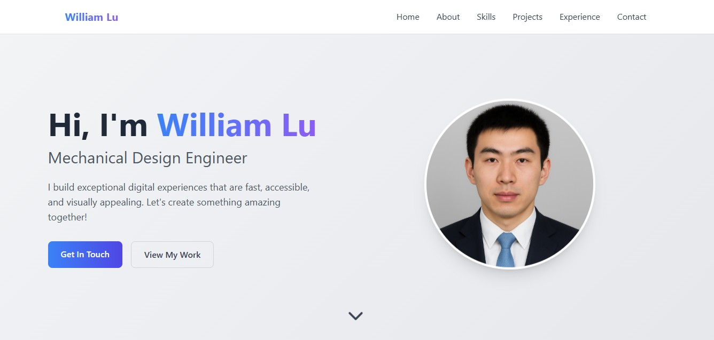

# 🖥️ Personal Portfolio Website
This is my **personal portfolio website**, where I showcase my work, projects, and skills.
It is built as a simple, responsive webpage to highlight my experience in web development, programming, and design.

👉 **Live Demo:** https://williaml12.github.io/Personal-Porfolio-Website/

## Showcase the website


## ✨ Features
- 📄 About Me section
- 💼 Portfolio / Projects showcase
- 🛠️ Skills & Technologies
- 📞 Contact Information
- 📱 Responsive design — mobile & desktop ready
- 🎨 Clean and modern design

## 📂 Project Structure
```
Personal-Porfolio-Website/
├── index.html         # Main page
├── /css               # Stylesheets
├── /images            # Images and assets
├── /js                # JavaScript files
├── README.md          # Project documentation
```

## 🚀 Getting Started
**Clone the Repository**
```
git clone https://github.com/williaml12/Personal-Porfolio-Website.git
cd Personal-Porfolio-Website
```

**Open in Browser**
Open `index.html` in your browser

or

Visit the live site: https://williaml12.github.io/Personal-Porfolio-Website/

## 🛠️ Built With
- HTML5
- CSS3
- JavaScript
- Deployed with **GitHub Pages**

## 📌 TODO / Future Improvements
- Add blog or writing section
- Add downloadable resume/CV
- Add animations or transitions
- Add SEO optimizations (meta tags, structured data)
- Improve accessibility (ARIA roles, keyboard navigation)

## 🤝 Contributions
Contributions are welcome! Feel free to fork the repo and submit a pull request for improvements.
If you find a bug or want to suggest an enhancement, feel free to open an issue.

## 📄 License
This project is open source and available under the [MIT License](LICENSE).
