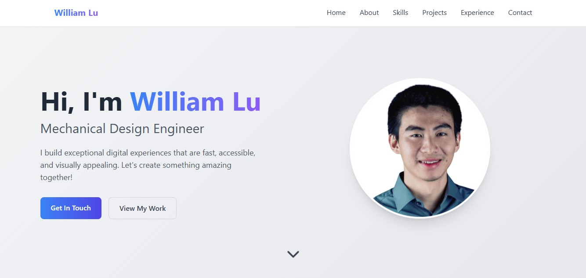

# Personal Porfolio Website

## Showcase the website

## Installation & Deployment 📦
- Clone the repository and modify the content of <b>index.html</b> according to your requirement.
- Add or remove images from `images` directory as per your requirement.
- I highly recommend to use [Github Pages](https://pages.github.com/) to deploy the website the EASIEST WAY.
- To deploy your website, first you need to create github repository with name `<your-github-username>.github.io`. Please don't give any other name.
- Push the generated code to the `master` or `main` branch of this repository.
## Sections 📚
✔️ Home\
✔️ About\
✔️ Skills \
✔️ Projects \
✔️ Experience\
✔️ Contact 

To view a live example, **[click here](https://williaml12.github.io/Personal-Porfolio-Website/)**
